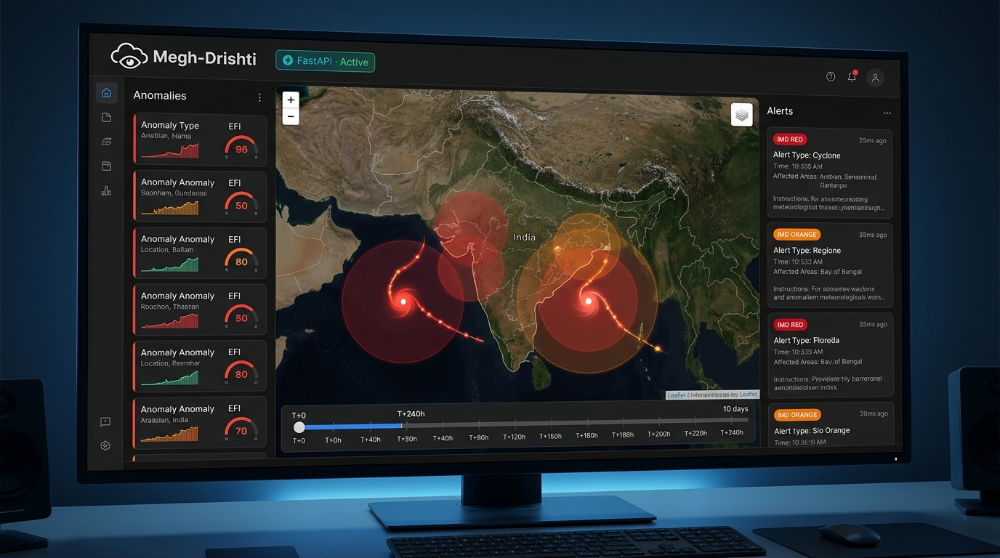
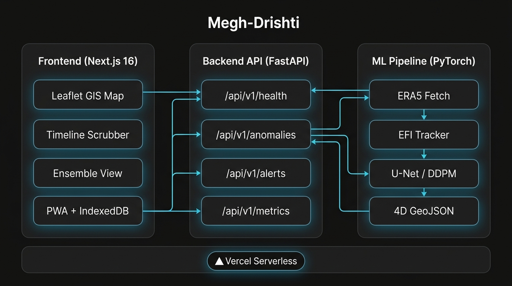

<div align="center">

# 🌩️ Megh-Drishti (मेघ-दृष्टि)

### AI-Driven Spatio-Temporal Tracking of Extreme Weather Anomalies

**Smart India Hackathon 2026 · PS 26078 · Ministry of Earth Sciences (MoES / NCMRWF)**

[](https://nextjs.org/)
[](https://fastapi.tiangolo.com/)
[](https://www.typescriptlang.org/)
[](https://python.org/)
[](LICENSE)

[](https://rakshak-indol-one.vercel.app)
[](https://rakshak-kappa-eight.vercel.app/docs)

</div>

<br/>



> **Megh-Drishti** tracks extreme weather events (3–10 day medium-range), downscales forecasts from 12 km → 5 km via conditional diffusion models, and delivers 5 km-radius IMD-aligned precision alerts — built for MoES, IMD, SDMA, and NDRF.

---

## ✨ Features

| | Feature | Description |
|--|---------|-------------|
| 🗺️ | **GIS Command Map** | Live Leaflet map · Doppler radar · DEM relief · Anomaly radius buffers |
| 📊 | **Ensemble Forecast** | p10/p50/p90 toggle · Cone of uncertainty · T+0→T+240h scrubber |
| 🔬 | **12km→5km Downscaling** | U-Net + DDPM · Before/after swipe comparator · Amplitude-preserving |
| 🚨 | **5km Subgrid Alerts** | IMD 4-tier severity · Lead time · Probability · MoES action directives |
| 📱 | **PWA + Offline** | Service worker · IndexedDB offline queue · Auto-sync on reconnect |
| 🌐 | **i18n** | Full EN / हिन्दी localisation — zero untranslated strings |

---

## 🏗️ Architecture



| Layer | Technology |
|:------|:-----------|
| Frontend | Next.js 16.3, React 19, TypeScript 5.7, Tailwind CSS v4 |
| GIS | React-Leaflet, OpenStreetMap, RainViewer API, OpenTopoMap |
| Backend | FastAPI 0.110, Pydantic v2, Uvicorn |
| ML | PyTorch 2.2, HuggingFace Diffusers, Xarray, Dask, Zarr |
| Offline | Service Worker, IndexedDB, Web Background Sync |
| Deploy | Vercel Serverless (Frontend + Backend) |

---

## ⚡ Quick Start

### Frontend
```bash
git clone https://github.com/theadityasarkar/Rakshak.git
cd Rakshak
pnpm install
cp .env.example .env.local   # set NEXT_PUBLIC_API_URL
pnpm dev                      # → http://localhost:3000
```

### Backend
```bash
cd backend
python -m venv .venv && source .venv/bin/activate
pip install -r requirements.txt
python -m uvicorn index:app --reload --port 8000   # → http://localhost:8000/docs
```

### Full Stack (Docker)
```bash
docker-compose up --build
```

---

## 🌐 Environment Variables

**`.env.local`** (frontend)
```env
NEXT_PUBLIC_API_URL=http://localhost:8000
NEXT_PUBLIC_DEMO_MODE=true
```

**Backend**
```env
DEMO_MODE=true
BACKEND_HOST=0.0.0.0
BACKEND_PORT=8000
```

---

## 📡 API Reference

Base URL: `https://rakshak-kappa-eight.vercel.app` · [Interactive Swagger Docs ↗](https://rakshak-kappa-eight.vercel.app/docs)

| Method | Endpoint | Description |
|--------|----------|-------------|
| `GET` | `/api/v1/health` | Service health + model status |
| `GET` | `/api/v1/anomalies` | All tracked anomalies |
| `GET` | `/api/v1/anomalies/{id}/track` | 4D GNN trajectory |
| `GET` | `/api/v1/anomalies/{id}/downscaled` | 12km vs 5km tensors |
| `POST` | `/api/v1/alerts/evaluate` | Evaluate `{lat, lon, radius_km}` |
| `GET` | `/api/v1/metrics` | RMSE, CRPS benchmarks |

```bash
# Quick health check
curl https://rakshak-kappa-eight.vercel.app/api/v1/health
# → {"status":"demo","demo_mode":true,"version":"1.0.0"}
```

> All demo data is loaded from `backend/data/demo/*.json` and labeled **"Demo / Scenario Simulator"** in the UI.

---

## 🎬 5-Minute Demo

| Min | What to do |
|-----|------------|
| **1** | Open [live dashboard](https://rakshak-indol-one.vercel.app) → observe IMD RED/ORANGE alert card + 5km radius |
| **2** | Press `Space` to play timeline T+0→T+240h · use `◀▶` arrows · toggle p10/p50/p90 ensemble cone |
| **3** | Click **"12km ⇄ 5km Swipe"** → drag divider → see peak amplitude recovery (85→148 mm/hr) |
| **4** | Click **"Replay Cyclone Amphan"** → Sundarbans landfall renders with 81h IMD best-track cone |
| **5** | DevTools → Offline → Log anomaly → restore network → watch IndexedDB auto-sync |

---

## 🔬 ML Pipeline

```
ERA5 NetCDF (CDS) → Zarr (Xarray+Dask) → EFI Scorer → 4D CC Tracker
                                                              ↓
                                                    (coarse, fine) pairs
                                                    ↙             ↘
                                              U-Net           Conditional DDPM
                                                    ↘             ↙
                                          RMSE · CRPS · Power Spectrum
                                                    ↓
                                           /api/v1/metrics  →  Model Evidence tab
```

### ERA5 Setup

1. Register at [Copernicus CDS](https://cds.climate.copernicus.eu/)
2. Create `~/.cdsapirc`:
   ```ini
   url: https://cds.climate.copernicus.eu/api
   key: <YOUR-API-KEY>
   ```
3. Run:
   ```bash
   pip install -r ml/requirements.txt
   python ml/data/fetch_era5.py --case cyclone_amphan
   ```

---

## 🧪 Testing

```bash
# Frontend
pnpm lint && pnpm typecheck

# Backend
cd backend && pytest tests/ -v

# ML unit tests (EFI range, tracker with synthetic arrays)
cd ml && pytest tests/ -v
```

---

## 🚀 Deployment

Two separate Vercel projects from the same repo:

**Backend** → Root Directory: `backend` · Preset: FastAPI · Env: `DEMO_MODE=true`

**Frontend** → Root Directory: `.` · Preset: Next.js · Env: `NEXT_PUBLIC_API_URL=<backend-url>`

---

## 🤝 Contributing

```bash
git checkout -b feat/your-feature
# make changes
git commit -m "feat: your feature"
git push origin feat/your-feature
# open Pull Request
```

- Run `pnpm lint && pnpm typecheck` before submitting
- Never hardcode model outputs — demo data lives in `data/demo/*.json`
- EFI range is `[-1, +1]`, not percent
- Read [AGENTS.md](AGENTS.md) for full project rules

---

## 👥 Team & Acknowledgments

Developed by **[@theadityasarkar](https://github.com/theadityasarkar)** for SIH 2026 (PS 26078).

Data sources: [RainViewer](https://www.rainviewer.com/) · [Open-Meteo](https://open-meteo.com/) · [OpenTopoMap](https://opentopomap.org/) · [Copernicus ERA5](https://cds.climate.copernicus.eu/)

---

<div align="center">

**Built for MoES · NCMRWF · IMD · SDMA · NDRF**

📄 [MIT License](LICENSE)

</div>
